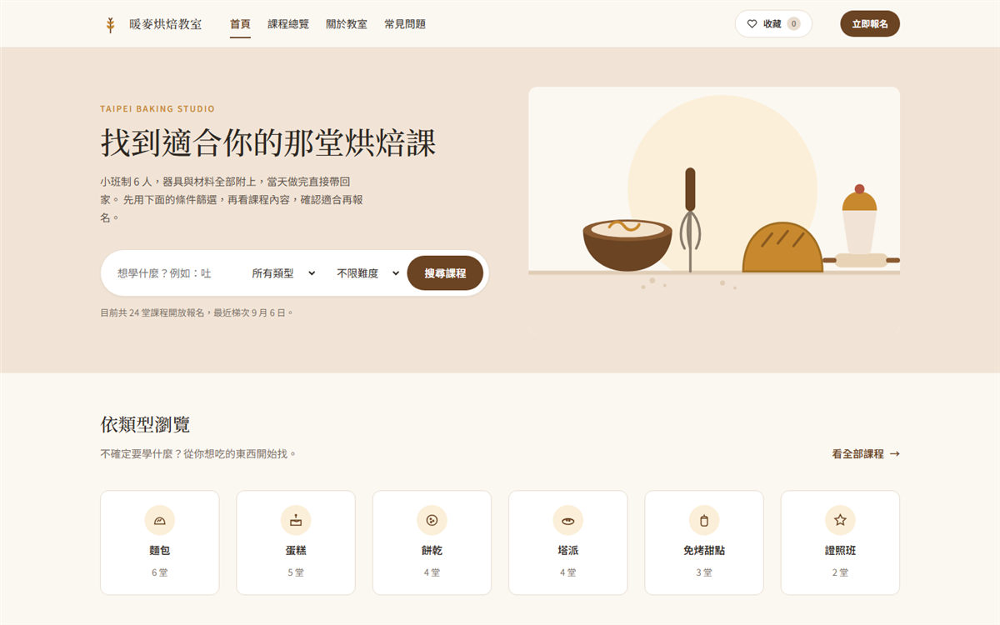

# 暖麥烘焙教室 Warm Wheat Baking Studio

A course-booking front end for a fictional Taipei baking studio — built as a
front-end demo. Hand-coded vanilla **HTML / CSS / JS**, no framework, no build step.
Open `index.html` and it runs.

**🔗 Live demo: [warmwheat-baking.vercel.app](https://warmwheat-baking.vercel.app)**



> **Note:** This is a portfolio demo. The studio, courses, instructors, prices,
> schedules and testimonials are all fictional placeholder content.

## Why this exists

I read five real Taiwanese baking-class sites before designing this one. They fail in
the same three places:

| | [cotton-cake](https://www.cotton-cake.com.tw/) | [best-168](https://www.best-168.com.tw/) |
|---|---|---|
| Price on course listings | ✗ | ✗ |
| Any filter or search | ✗ | ✗ |
| Clear path to enrol | ✗ | ✗ (phone only) |

創業家烘焙 has been running **35 years** and still shows no price, no dates, no class
size and no enrol button on its listings. Even [Bread Ahead](https://www.breadahead.com/)
in London — the best-in-class benchmark — shows no class size, no day-of timetable, no
kit list and no FAQ on its course pages.

So this demo prices every course, filters nine of them six ways, and screens for fit
*before* it takes a booking.

## The three jobs

A baking studio's site has to do three things in order, and most sites only do the
first one badly:

| | Page | What the visitor is actually doing |
|---|---|---|
| **Find** | `courses.html` | Narrowing 9 courses down to the 2 worth reading about |
| **Understand** | `course.html` | Working out what happens in the room for 3.5 hours |
| **Self-assess** | `enroll.html` | Deciding whether the course is wrong *for them* |

The third one is the interesting one. A beginner booking an advanced croissant class
has a bad day and asks for a refund; someone with a dairy allergy booking a milk-bread
class cannot be accommodated at all, because the recipe *is* the allergen. So the
booking flow opens with a five-question self-assessment that can return **"book it"**,
**"you can, but read this first"**, or **"this one won't work for you — here's the one
that will"** — and it never hard-blocks, because it's advice, not a gate.

## Highlights

- **Faceted course filtering** — six categories, three levels, three time slots, four
  price bands, keyword search, availability and four sort orders, all combinable, with
  removable filter chips and a real empty state. Runs off `data-*` attributes on the
  cards, so the grid still renders as a plain list with JS disabled.
- **Eligibility assessment** — rule-based fit / caution / blocked verdicts driven by
  experience level, goal, schedule and allergens, feeding a four-step booking flow with
  per-step validation and a confirmation summary.
- **Saved courses** — heart a course from any page; count, drawer and hearts all render
  from one array so they can't drift out of sync. Persisted in `localStorage`, degrades
  quietly in private mode.
- **Structured data** — `Course` with `CourseInstance` offers and seat availability,
  `FAQPage`, `ItemList` and `LocalBusiness` JSON-LD. None of the competitor sites
  reviewed carry any.
- **LINE as a first-class channel** — Taiwanese small businesses convert on LINE
  官方帳號, not web forms, so it gets a persistent CTA rather than a footer link.
- **Token-first CSS** — every colour, type step, spacing unit and radius lives in
  `styles/tokens.css` as custom properties; the whole site re-themes from one file.
- **Progressive enhancement** — controls that need JS (save, quick filters) are
  *injected* by JS rather than authored into the HTML, so nothing dead ships to a
  visitor with scripting off. FAQ, nav and content all work without it.
- **Accessibility** — semantic landmarks, `role="group"` + `aria-labelledby` question
  groups, `aria-pressed` toggles, `aria-live` result counts, keyboard-operable drawer
  with focus return, visible focus rings, `prefers-reduced-motion` honoured.

## Structure

```
index.html            首頁 — hero search, categories, popular courses, assessment CTA
courses.html          課程總覽 — filter sidebar + results (the "find" step)
course.html           課程內頁 — syllabus, timetable, kit, instructor, FAQ, booking card
enroll.html           報名 — 4-step flow, opens with the eligibility assessment
about.html            關於教室 — story, teaching approach, teachers, equipment, access
faq.html              常見問題 — 5 categories, 20 questions
styles/
  tokens.css          design tokens (colour, type, spacing, radius, motion)
  base.css            reset + typography
  layout.css          containers, page shells, grids
  components.css      every component
scripts/
  main.js             shared — FAQ accordion, hero search
  courses.js          filtering, search, sorting, active-filter chips
  enroll.js           assessment rules + 4-step booking flow
  saved.js            saved courses (localStorage) + drawer
assets/               placeholder SVG illustrations & icons
```

## Design target

Desktop-first (1440 frame, 1200 content) — this is a booking flow people work through
at a desk. Below 1024 the layout degrades to a single column so nothing breaks on a
laptop, but it is a fallback rather than a designed mobile experience.

## Tech notes

- Fonts: Noto Sans TC + Noto Serif TC via Google Fonts.
- No dependencies, no bundler — deploy by uploading the folder (see `DEPLOYMENT.md`).
- Booking, payment and the assessment are front-end only. Nothing is sent anywhere.
- `courses.html` reads `?q=`, `?cat=` and `?lv=` so the homepage search deep-links into
  a pre-filtered result set.

## Run

Open `index.html` in a browser, or serve the folder:

```bash
npx serve .
```

Serving over HTTP (rather than `file://`) is worth it — `localStorage` and the query-string
deep links behave properly.
